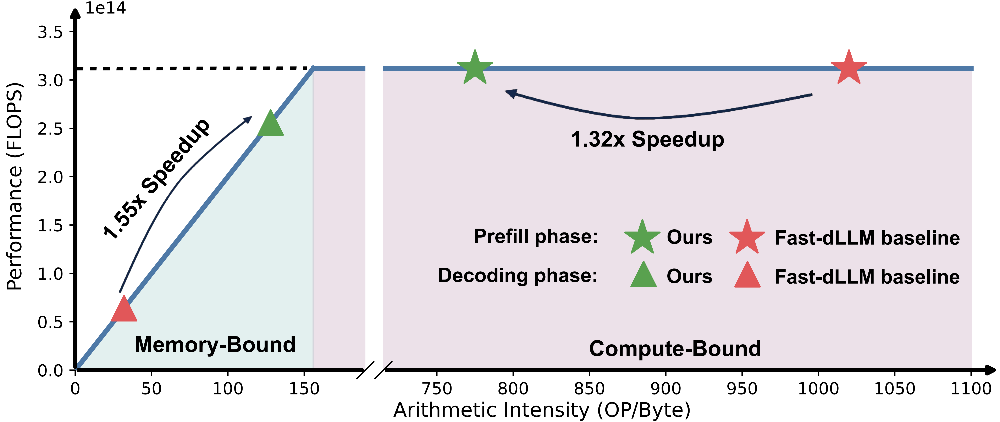
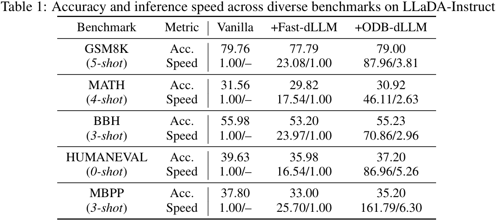
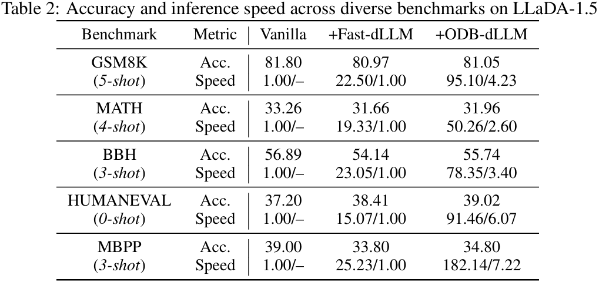

# Orchestrating Dual-Boundaries: An Arithmetic Intensity Inspired Acceleration Framework for Diffusion Language Models

<div align="center">
  
</div>

We propose ODB-dLLM, an arithmetic intensity inspired framework for accelerating diffusion-based large language models. By analyzing the interleaved compute- and memory-bound phases in existing dLLM inference frameworks, ODB-dLLM introduces adaptive length prediction strategy and jump-share speculative decoding to optimize computation-memory characteristics on hardware platforms, thereby maximizing inference efficiency.

**Overall Performance:**

ODB-dLLM achieves 46×–162× speedup on LLaDA-Instruct and 50–182× speedup on LLaDA-1.5. Compared with Fast-dLLM, ODB-dLLM also delivers 2.63–6.30× and 2.60–7.22× speedup on the two models, respectively.
<div align="center">
  
</div>
<div align="center">
  
</div>

### Installation
1.Clone the repository:
```
git clone https://github.com/PKU-SEC-Lab/ODB-dLLM.git
cd ODB-dLLM
```
2.Install dependencies:
```
conda create --name ODB-dLLM python=3.10
conda activate ODB-dLLM
pip install -r requirements.txt
```

### Usage
For LLaDA-8B-Instruct ([LLaDA](https://github.com/ML-GSAI/LLaDA)) model:
```
cd llada_instruct
./eval_llada_instruct.sh <GPU_ID> <Task_Name> 'GSAI-ML/LLaDA-8B-Instruct' <Settings>
```

For LLaDA-1.5 ([LLaDA-1.5](https://github.com/ML-GSAI/LLaDA-1.5)) model:
```
cd llada_1_5
./eval_llada_1_5.sh <GPU_ID> <Task_Name> 'GSAI-ML/LLaDA-1.5' <Settings>
```

Parameter descriptions:
- `<GPU_ID>`: Choose which GPU to run on
- `<Task_Name>`: Select the benchmark for evaluation
  - Options: `gsm8k, minerva_math, bbh, humaneval, mbpp`
- `<Settings>`: Select the configuration for evaluation
  - Options:
    - `llada_baseline`: LLaDA baseline
    - `fast_dllm_baseline`: Fast-dLLM baseline: parallel + dualcache
    - `alp`: parallel + dualcache + adaptive length prediction
    - `accept-jump`: parallel + dualcache + adaptive length prediction + accept-jump speculative
    - `jump-share`: parallel + dualcache + adaptive length prediction + jump-share speculative

Example:
```
cd llada_instruct
./eval_llada_instruct.sh 0 gsm8k 'GSAI-ML/LLaDA-8B-Instruct' jump-share
```

### Acknowledgements
This repo is largely based on [Fast-dLLM](https://github.com/NVlabs/Fast-dLLM). We would also like to thank the authors of [LLaDA](https://github.com/ML-GSAI/LLaDA) and [LLaDA-1.5](https://github.com/ML-GSAI/LLaDA-1.5) for their excellent work and open-source contributions.
